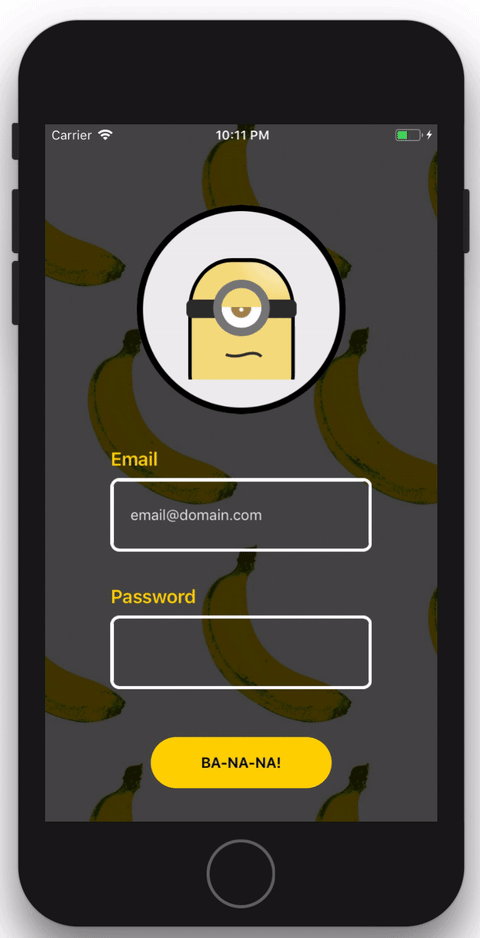

# Minion Themed Interactive Login



## TODO

1. Fix the render bug on Android

2. Calculate the stareAt(text). It currently uses the length of text. Can be off in an edge case like "iiiiiiiiii."

Open for pull requests! :-D

## Try it out

Try it with Exponent: https://exp.host/@sungwoopark95/react-native-lottie-minion

## Run it locally

To install, there are two steps:

1. Install Exponent XDE [following this guide](https://docs.getexponent.com/versions/latest/introduction/installation.html).
   Also install the Exponent app on your phone if you want to test it on
   your device, otherwise you don't need to do anything for the simulator.

2. Clone this repo and run `npm install`

```bash
git clone https://github.com/ggomaeng/react-native-lottie-minion.git minion
cd minion
npm install
```

3. Open the project with Exponent XDE and run it.
